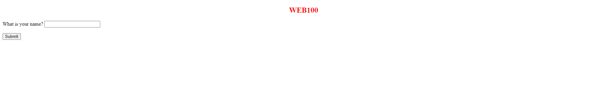
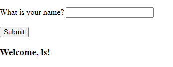
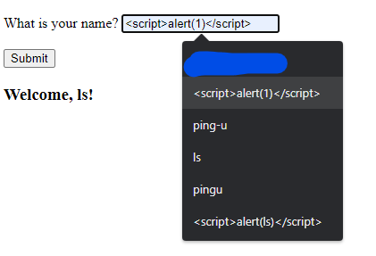
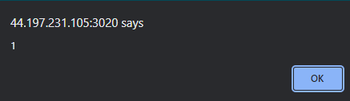
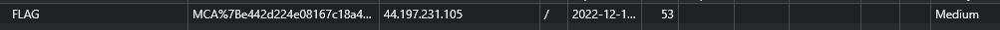
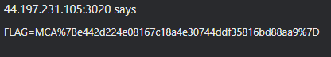
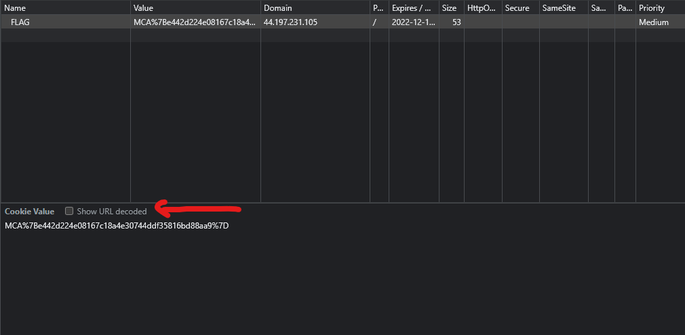
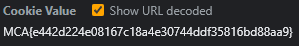

# Web 100
## Description 
They told me make it easy, so I did.
http://44.197.231.105:3020



So, we have an input. What does the site do?
Whenever I see an input in a web-app, the first thing I always do command execution


Looks like that doesn't work...
What else works?



For some reason saved inputs show up. One is a XSS input, which actually works!



I looked through the web a bit more and found a cookie!



We can use XSS to print the cookie's value
```<script>alert(document.cookie)</script>```



But it doesn't look easily readable (where are the brackets?), luckily google has a feature



If we click that button...



Flag: `MCA{e442d224e08167c18a4e30744ddf35816bd88aa9}`